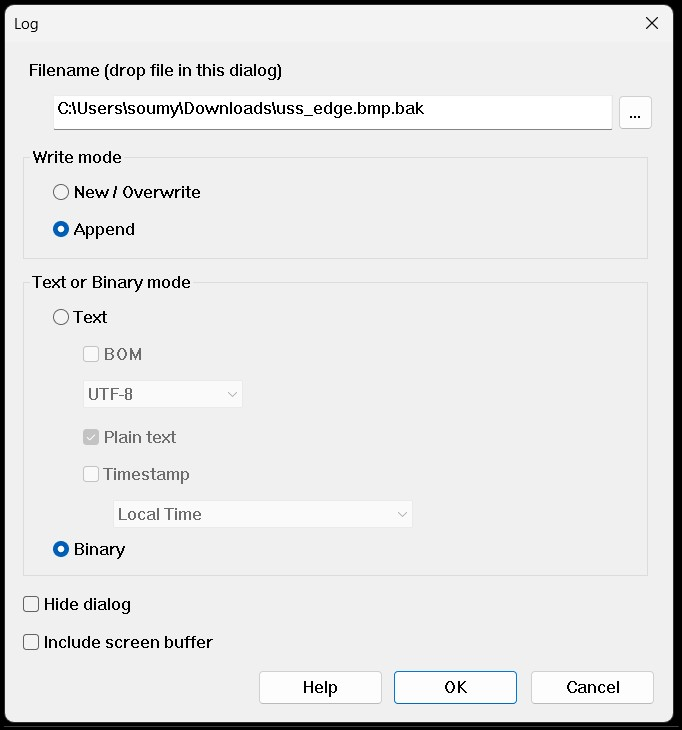
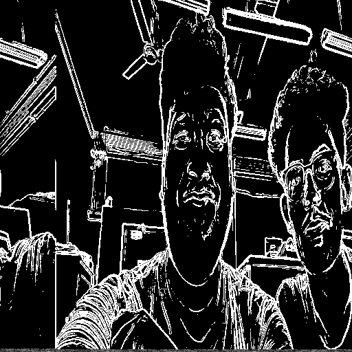

# Sobel Edge Detection In PYNQ-Z2 FPGA🚀

This repository demonstrates the implementation of the Sobel edge detection algorithm on the **PYNQ-Z2 FPGA** using Verilog HDL. The project leverages hardware acceleration to efficiently process images, showcasing the capabilities of FPGA-based image processing.

---

## Overview  
Sobel edge detection is a fundamental image processing algorithm used to identify edges by detecting intensity gradients. This project implements the algorithm on an FPGA to demonstrate its performance and hardware efficiency.

---

## Features  
- Written entirely in **Verilog HDL**.
- Simulation, synthesis, and implementation using **AMD Vivado**.
- Target hardware: **PYNQ-Z2 FPGA board**.
- **Input:** Grayscale bitmap images.  
- **Output:** Edge-detected bitmap images.  
- Modular design for scalability and reusability.

---

## Tools and Technology  
- **HDL Language:** Verilog  
- **Simulation & Synthesis:** AMD Vivado  
- **Development Board:** PYNQ-Z2  

---

## Simulation Result

**Input Image**  
  

**Output Image**  
  

---

## HardWare Implementation Result

**Board Image**
  

**Serial Port Setup**
- Use TeraTerm Serial Port and Setup Correct COM port and Baud Rate
  

 **Log Setup**
- Use TeraTerm Log to get back processed Data 
  

  **SDK Configuration**
-  After Exporting Block Diagram As Hardware , Add necessary imageIPTest.c And ImageData.h
 

**Post Processing**
 - After Reciving the Data to the log file we need to add the Header part to view the image.
 - For that We will use HxD64 app.
 - we will copy 1080 bytes data[000h - 437h] from our gray scale image and paste it at the begining of our log file.

**HxD_Post_Processing**
    

**Input Image**  
  

**Output Image**  

## Getting Started  

### Prerequisites  
1. **AMD Vivado:** Install the latest version of Vivado.  
2. **PYNQ-Z2 Board:** Ensure the FPGA board is properly set up with the necessary drivers.
3. **MATLAB (optional):** Use the provided script to preprocess images.  
4. **Input Image:** Provide a grayscale bitmap (.bmp) image for processing.

## Reference

https://youtube.com/playlist?list=PLXHMvqUANAFOviU0J8HSp0E91lLJInzX1&si=pqnmj060RRyLJrv9

